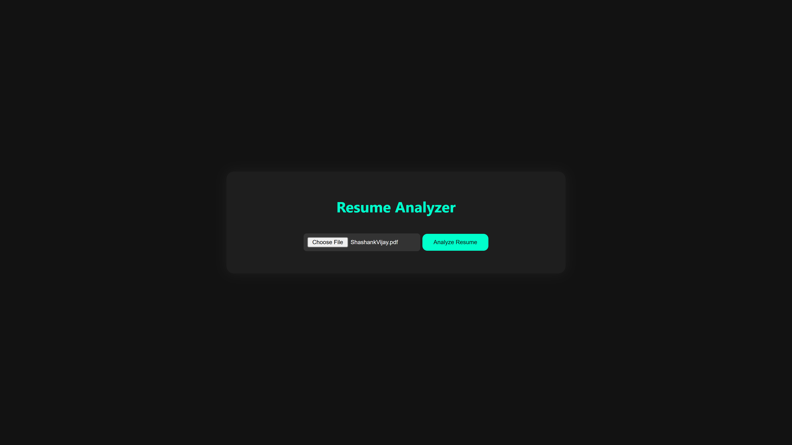
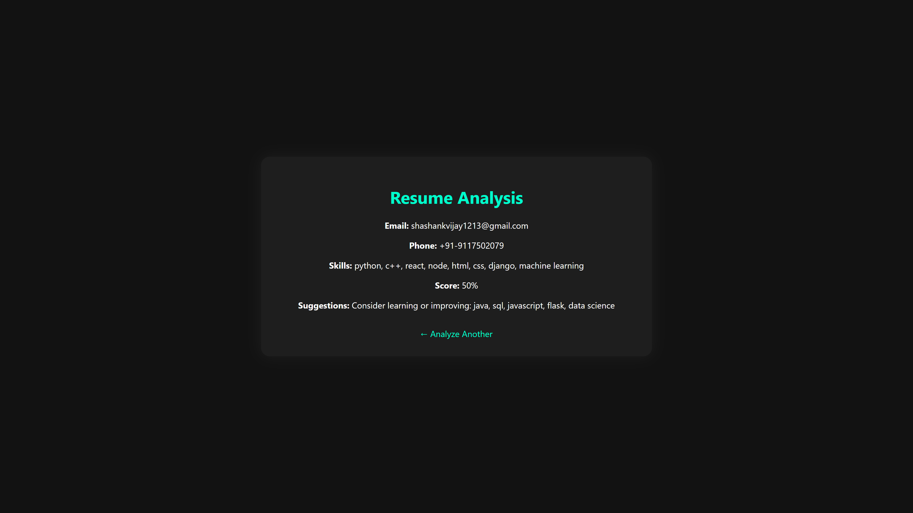

A web-based resume analyzer built with Python (Flask) and HTML/CSS. Upload your resume as a PDF to extract contact details, match skills, calculate a score, and get smart suggestions for improvement.

🚀 Features:-

✅ Email and phone number detection

✅ Skill extraction & match scoring

✅ AI-style suggestions based on missing skills

### 📸 Demo

